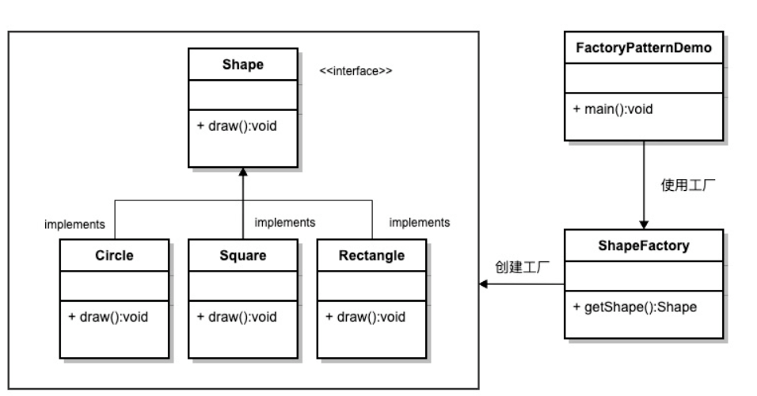
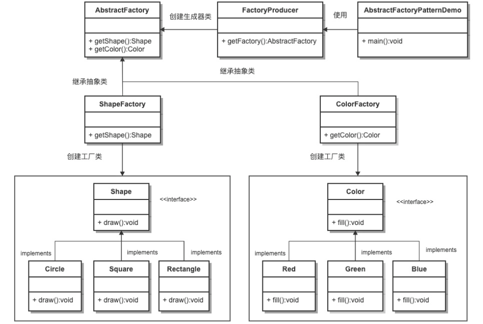
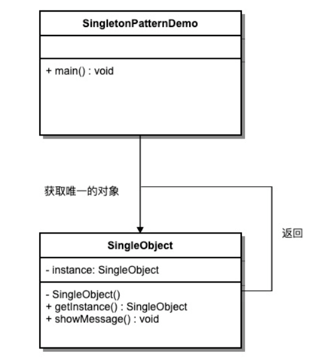
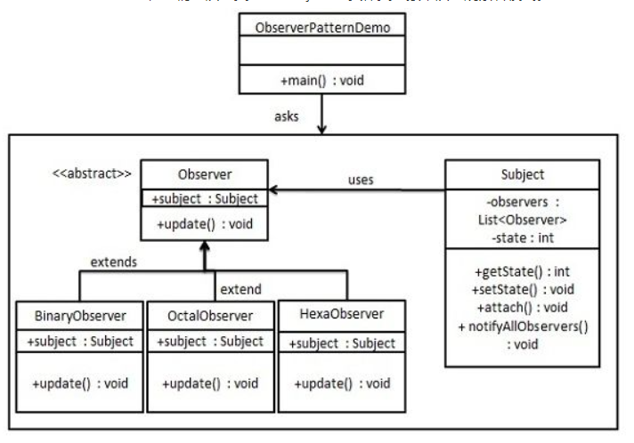

# DesignPatterns

偶然之间，看到了侯捷巨佬的[C++视频](https://www.bilibili.com/video/BV1gb411g7pa)

(是我看到的对C++讲的最好的人呐~)，于是对软件工程中的设计模式产生了兴趣。在加上最近项目中也确实看到了很多设计模式的实现，所以有必要梳理一下~

C++实现编程中常见设计模式(工厂/单例/组合/享元/观察/状态等)

参考[设计模式相关教程网站](https://www.runoob.com/design-pattern/design-pattern-tutorial.html)

首先实现常见的几种设计模式，剩下的慢慢来更···

## 工厂模式

工厂模式（Factory Pattern）是比较最常用的设计模式之一。这种类型的设计模式属于创建型模式，它提供了一种创建对象的最佳方式。

在工厂模式中，我们在创建对象时不会对客户端暴露创建逻辑，并且是通过使用一个共同的接口来指向新创建的对象。

有图就不多BB：

我们将创建一个 *Shape* 接口和实现 *Shape* 接口的实体类。下一步是定义工厂类 *ShapeFactory*。

*FactoryPatternDemo* 类使用 *ShapeFactory* 来获取 *Shape* 对象。它将向 *ShapeFactory* 传递信息（CIRCLE / RECTANGLE / SQUARE），以便获取它所需对象的类型。

说白了就是虚函数和多态！！！

有个客户通过工厂的getShape接口，说，我要个Circle的形状，那么工厂就返回给他一个Circle的形状；
客户变卦了，通过工厂的getShape接口，说，我要个Square的形状，那么工厂就返回给他一个Square的形状。

这就是通过同一个接口，返回不同的产品对象，实现不同的逻辑；这个接口是被这个工厂管理的。所以叫做工厂模式。

## 抽象工厂模式

工厂模式确实很容易理解，但是在实际大型项目中，很多时候用的都是抽象工厂模式，所以这里要学会抽象工厂模式。

抽象工厂模式（Abstract Factory Pattern）是围绕一个超级工厂创建其他工厂。该超级工厂又称为其他工厂的工厂。这种类型的设计模式属于创建型模式，它提供了一种创建对象的最佳方式。

在抽象工厂模式中，接口是负责创建一个相关对象的工厂，不需要显式指定它们的类。每个生成的工厂都能按照工厂模式提供对象。

有图就不多BB：

我们将创建 *Shape* 和 *Color* 接口和实现这些接口的实体类。下一步是创建抽象工厂类 *AbstractFactory*。接着定义工厂类 *ShapeFactory* 和 *ColorFactory*，这两个工厂类都是扩展了 *AbstractFactory*。然后创建一个工厂创造器/生成器类 *FactoryProducer*。

*AbstractFactoryPatternDemo* 类使用 *FactoryProducer* 来获取 *AbstractFactory* 对象。它将向 *AbstractFactory* 传递形状信息 *Shape（CIRCLE / RECTANGLE / SQUARE）*，以便获取它所需对象的类型。同时它还向 *AbstractFactory* 传递颜色信息 *Color（RED / GREEN / BLUE）*，以便获取它所需对象的类型。

说白了还是虚函数和多态！！！只是一下子搞了两层的虚函数和多态！！！相当于是工厂也给抽象出基类了，不同的工厂对象，可以取得不同性质的产品：形状和颜色。

可以看到，工厂模式的缺陷还是比较明显的，那就是多一层抽象就会一下子多出来好多类来维护。

>仍然记得侯捷大神说的，参数尽量传引用。所以code中基本都是用的引用，和指针。
>另外，该delete的时候，一定要delete~

## 单例模式

单例模式（Singleton Pattern）是最简单的设计模式之一，但很少自己单独使用。这种类型的设计模式属于创建型模式，它提供了一种创建对象的最佳方式。

这种模式涉及到一个单一的类，该类负责创建自己的对象，同时确保只有单个对象被创建。这个类提供了一种访问其唯一的对象的方式，可以直接访问，不需要实例化该类的对象。

注意：

1、单例类只能有一个实例。
2、单例类必须自己创建自己的唯一实例。
3、单例类必须给所有其他对象提供这一实例。

有图就不多BB：

我们将创建一个 *SingleObject* 类。*SingleObject* 类有它的私有构造函数和本身的一个静态实例。

*SingleObject* 类提供了一个静态方法，供外界获取它的静态实例。*SingletonPatternDemo* 类使用 *SingleObject* 类来获取 *SingleObject* 对象。

单例真的可以说是非常简单了，说白了就是一直用这个静态的对象(指针)来调用里面的接口。重点知识还是对static的应用！！！

>侯捷大神也曾经在构造函数private化的时候，提到了单例。这也是单例的一个特征，相当于告诉外界，你们谁也别想实例化我的对象。
>当然，能用指针就用指针~所以我的code中，返回的依然是类对象指针。

但是单例要考虑**线程安全**~所以这里引申一下...

说起线程，我们都知道线程有独立的stack栈空间，但是heap堆空间是共享的。
每个线程确实可以new一片新的内存空间在堆里面，这种方法被称为Thread Local Storage (TLS)，但是某一个线程建立的heap空间别的线程也是可以访问的。
比如某一个线程使用 Object\* o = new Object() 新建一个对象，这个对象是在heap中，而指针o是在stack中，只要这个线程把指针o的值发给别的线程，然后别的线程用另一个指针p来接收，那么别的线程依然能够访问这个线程new的对象，这就是共享heap空间的解释。
一般不建议在线程中用new开辟新内存空间，因为heap是共享的，所以一个线程在用new的时候别的所有线程都得停下来等，这样就有很大的同步代价.  如果m个线程每个线程分配n大小的内存到heap，那么就需要m次内存分配的操作，所有的线程需要等m次。
记住每一个new操作都是很耗时的。我们完全可以只分配一次m\*n大小的内存到heap，然后每个线程访问自己需要访问的部分。这样只需要一次内存分配，而且之后的操作没有同步代价。

然后单例这里的多线程的解决方法我就先不写了...因为我现在写不出来这个C++代码...

## 观察模式

当对象间存在一对多关系时，则使用观察者模式（Observer Pattern）。比如，当一个对象被修改时，则会自动通知依赖它的对象。观察者模式属于行为型模式。在Unity中其实太常见了，事件机制就可以认为是观察者模式的应用。

有图就不多BB：

观察者模式使用三个类 Subject、Observer 和 Client。Subject 对象带有绑定观察者到 Client 对象和从 Client 对象解绑观察者的方法。我们创建 *Subject* 类、*Observer* 抽象类和扩展了抽象类 *Observer* 的实体类。

*ObserverPatternDemo*，我们的演示类使用 *Subject* 和实体类对象来演示观察者模式。

说实话，这个观察者模式真的有点恶心...虽然它很重要，应用场景也很多。

主要是代码中也可以看到它就是在来回调用，目标对象和观察者类之间的耦合性非常强，很容易搞出幺蛾子，各种注册/解除注册、指针引用。对编程者的梳理能力要求较高，所以要多看几遍，多实操一下。

## 状态模式

## 组合模式

## 享元模式

